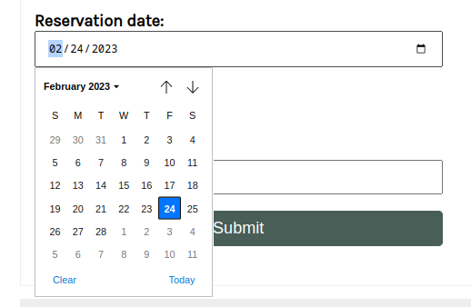

# Final Project README

<aside>
💡 Dear peer, please read this file so you can review the project without problems

</aside>

# Dependencies

This project has the following dependencies

```bash
django = "*"
mysqlclient = "*"
djangorestframework = "*"
```

<aside>
💡 Follow the instructions below to install and successfully setup the project

</aside>

# Installation

Install the dependencies by running

```jsx
pipenv install
```

# Database Setup

Make sure you have a database properly configured according to these settings

```python
DATABASES = {
    'default': {
        'ENGINE': 'django.db.backends.mysql',
        'NAME': 'reservations',
        'USER': 'admin',
        'PASSWORD': '',
        'HOST': 'localhost',
        'PORT': 3306,
    }
}

```

### To make this setup

Create the ****************************reservations**************************** database

```python
CREATE DATABASE reservations;
```

<aside>
💡 If you already have a database with this name which contains the tables that might cause issues, use a different name for the database, such as ****************************reservationsFullstack****************************

</aside>

Create the user **admin** by running the following in the MySQL shell 

```python
CREATE USER admin@localhost;
```

<aside>
💡 Note that we are not setting a password for this user to simplify things

</aside>

Grant the privileges over the ******reservations****** database to the just-created user

```python
GRANT ALL PRIVILEGES ON reservations.* TO admin@localhost;
```

<aside>
💡 Set up your own database if you prefer, but don’t forget to change the settings.

</aside>

# ****Review criteria****

1. Is the app added to the installed apps list in the settings file?
    
    **Check config/settings.py, line #43**
    
2. Is the database configuration updated inside the settings file?
    
    **************************************Just as shown in the Database section above, it is.**************************************
    
3. Were migrations performed?
    
    **This question refers to if the migrations that you must run, performed without problems** 
    
4. Are there three fields in the booking form: First name, Reservation date, and Reservation slot?
    
    This is my **Booking** model. I added an extra field (reservation_time) for extra functionality
    
    ```python
    class Booking(models.Model):
        first_name = models.CharField(max_length=200)
        reservation_date = models.DateField(default=timezone.now)
        reservation_time = models.TimeField(choices=RESERVATION_TIME, default=time(hour=22, minute=30))
        reservation_slot = models.SmallIntegerField(default=10)
    ```
    
5. Does a date selector open up when you click on the reservation date field on the booking form?
    
    In the Book section on the webpage, you can click on the **calendar icon** that is inside the reservation_date field (at the left) and a calendar opens up for you to select the date, just as shown here
    
    
    

1. Are all the bookings available as JSON data on the reservations page?
    
    In both the ********************Bookings******************** section, on the webpage, you can see the displayed bookings **********************for the day********************** as json
    
     ****************************************
    
    
    

 You also can get the bookings by fetching the endpoint:

[**http://127.0.0.1:8000/bookings-api**](http://127.0.0.1:8000/bookings/)

Or for a specific date:

[http://127.0.0.1:8000/bookings](http://127.0.0.1:8000/bookings/)-api?date=2023-02-25

1. Is duplicate booking prohibited on a specific date if the time is already booked?
    
    If a user is trying to book a slot already occupied for the selected time and date, then the book will be prohibited
    
    
    
2. Does changing the date refresh the booking data?
    
    Every time you select a date to make a booking, the data next to the booking form will be updated according to the selected date. The JavaScript on the page will fetch the bookings for the selected date and update the bookings.  
    
    
    
    If no bookings were found for the selected date, then a ************************No Bookings************************  message will be shown
    
      
    
    
    
3. Is a duplicate booking on a specific date and time unavailable if the slot is already booked?
    
    As shown in **question 7**, it is!
    
4. Can you display bookings for a specific date using the API?
    
    Yes, just go ************************reservation************************ URL and filter the bookings by date using the query parameter ******************date,****************** as shown below:
    
    [http://127.0.0.1:8000/bookings/?date=2023-02-28](http://127.0.0.1:8000/bookings/?date=2023-02-28)
    
    
    
5. If there is no booking, does a **No Booking** message show for that date?
    
    If there are no bookings for a date, a ********************No Booking******************** message is shown 
    


1. Was fetch API used to retrieve data from the API?
    
    For the **********Book********** section on the webpage, the booking data is retrieved by ************fetching************ the endpoint
    
    [http://127.0.0.1:8000/bookings](http://127.0.0.1:8000/bookings/)-api?date={queryDate} as shown below: ************************
    
    *restaurant/templates/book.html*
    
    
    
    <aside>
    💡 The endpoint is always fetched using the date in the form. The inputted date is retrieved with the getDateFromInput() function, shown in line 83 in the snippet above.
    
    </aside>
    
2. Is the current date automatically selected when you open the booking form?
    
    When you load the page, the **************************************************current date is selected************************************************** and the bookings for that day are shown. The time is also selected, for the default value of 22:30h (10:20 pm)